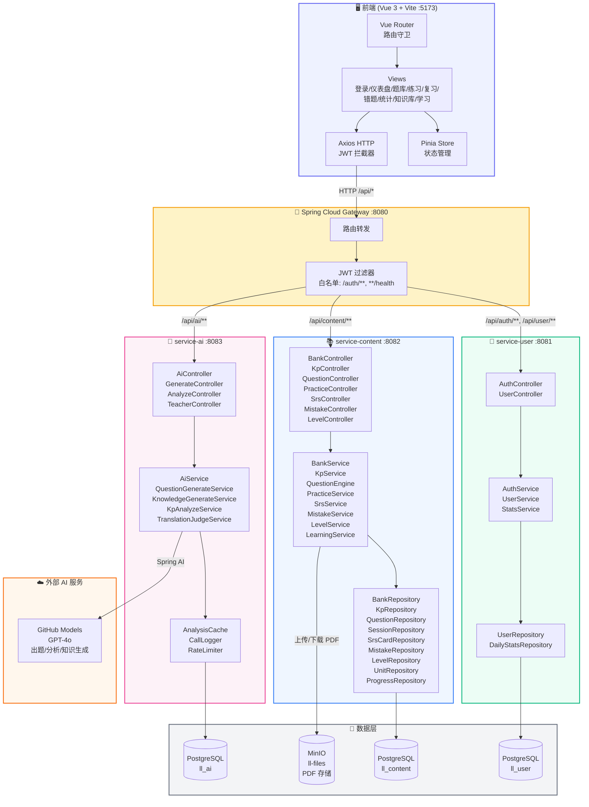
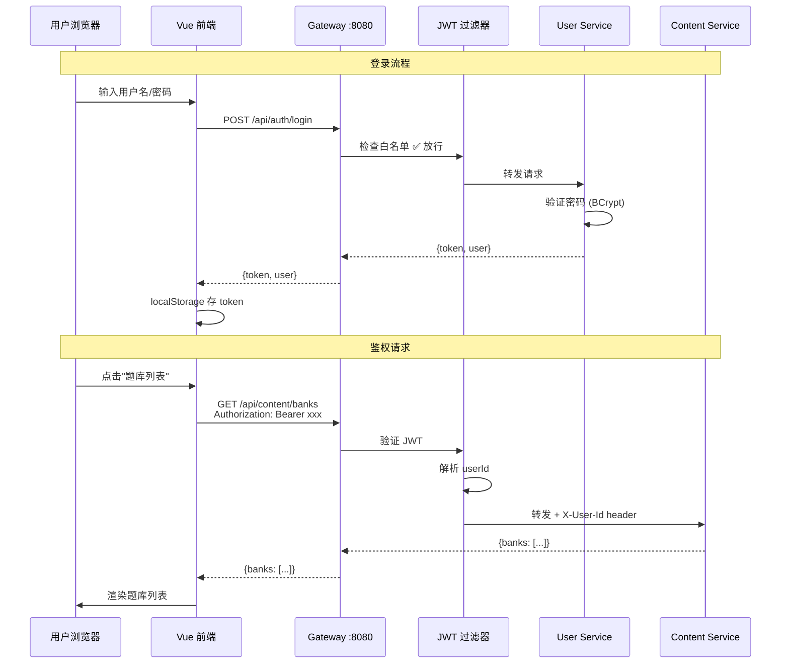
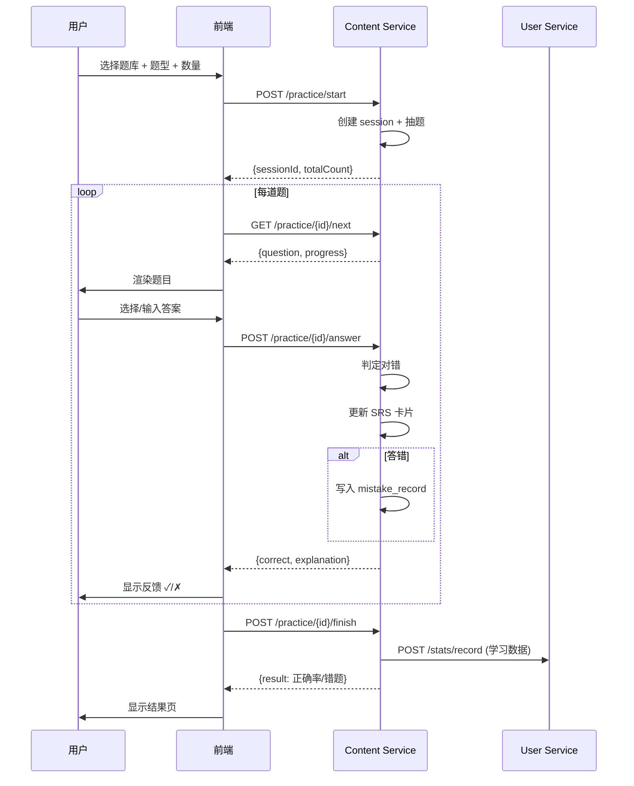
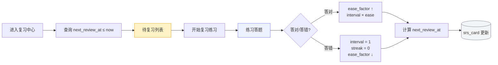
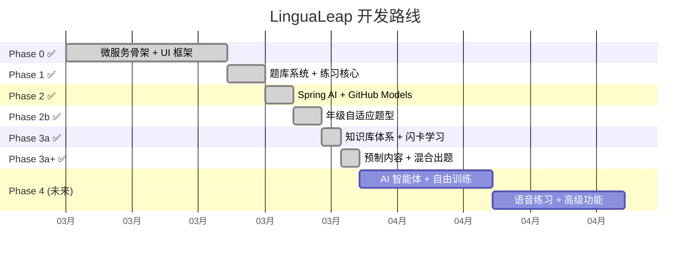
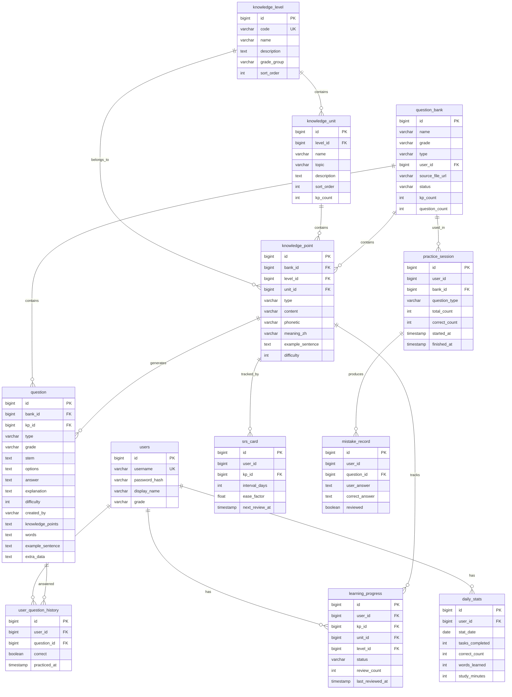

# LinguaLeap 系统架构图

## 一、整体架构

```mermaid
graph TB
    subgraph 前端["🖥️ 前端 (Vue 3 + Vite :5173)"]
        FE_Router["Vue Router<br/>路由守卫"]
        FE_Pinia["Pinia Store<br/>状态管理"]
        FE_Views["Views<br/>登录/仪表盘/题库/练习/复习/错题/统计/知识库/学习"]
        FE_API["Axios HTTP<br/>JWT 拦截器"]
    end

    FE_Router --> FE_Views
    FE_Views --> FE_Pinia
    FE_Views --> FE_API

    FE_API -->|"HTTP /api/*"| GW

    subgraph 网关["🔀 Spring Cloud Gateway :8080"]
        GW["路由转发"]
        JWT_Filter["JWT 过滤器<br/>白名单: /auth/**, **/health"]
    end

    GW --> JWT_Filter

    JWT_Filter -->|"/api/auth/**, /api/user/**"| SVC_USER
    JWT_Filter -->|"/api/content/**"| SVC_CONTENT
    JWT_Filter -->|"/api/ai/**"| SVC_AI

    subgraph 用户服务["👤 service-user :8081"]
        SVC_USER["AuthController<br/>UserController"]
        SVC_USER_SVC["AuthService<br/>UserService<br/>StatsService"]
        SVC_USER_REPO["UserRepository<br/>DailyStatsRepository"]
    end

    SVC_USER --> SVC_USER_SVC --> SVC_USER_REPO

    subgraph 题库服务["📚 service-content :8082"]
        SVC_CONTENT["BankController<br/>KpController<br/>QuestionController<br/>PracticeController<br/>SrsController<br/>MistakeController<br/>LevelController"]
        SVC_CONTENT_SVC["BankService<br/>KpService<br/>QuestionEngine<br/>PracticeService<br/>SrsService<br/>MistakeService<br/>LevelService<br/>LearningService"]
        SVC_CONTENT_REPO["BankRepository<br/>KpRepository<br/>QuestionRepository<br/>SessionRepository<br/>SrsCardRepository<br/>MistakeRepository<br/>LevelRepository<br/>UnitRepository<br/>ProgressRepository"]
    end

    SVC_CONTENT --> SVC_CONTENT_SVC --> SVC_CONTENT_REPO

    subgraph AI服务["🤖 service-ai :8083"]
        SVC_AI["AiController<br/>GenerateController<br/>AnalyzeController<br/>TeacherController"]
        SVC_AI_SVC["AiService<br/>QuestionGenerateService<br/>KnowledgeGenerateService<br/>KpAnalyzeService<br/>TranslationJudgeService"]
        SVC_AI_CACHE["AnalysisCache<br/>CallLogger<br/>RateLimiter"]
    end

    SVC_AI --> SVC_AI_SVC --> SVC_AI_CACHE

    subgraph 数据层["💾 数据层"]
        PG_USER[("PostgreSQL<br/>ll_user")]
        PG_CONTENT[("PostgreSQL<br/>ll_content")]
        PG_AI[("PostgreSQL<br/>ll_ai")]
        MINIO[("MinIO<br/>ll-files<br/>PDF 存储")]
    end

    SVC_USER_REPO --> PG_USER
    SVC_CONTENT_REPO --> PG_CONTENT
    SVC_CONTENT_SVC -->|"上传/下载 PDF"| MINIO
    SVC_AI_CACHE --> PG_AI

    subgraph 外部服务["☁️ 外部 AI 服务"]
        GITHUB_MODELS["GitHub Models<br/>GPT-4o<br/>出题/分析/知识生成"]
    end

    SVC_AI_SVC -->|"Spring AI"| GITHUB_MODELS

    style 前端 fill:#EEF2FF,stroke:#6366F1,stroke-width:2px
    style 网关 fill:#FEF3C7,stroke:#F59E0B,stroke-width:2px
    style 用户服务 fill:#ECFDF5,stroke:#10B981,stroke-width:2px
    style 题库服务 fill:#EFF6FF,stroke:#3B82F6,stroke-width:2px
    style AI服务 fill:#FDF2F8,stroke:#EC4899,stroke-width:2px
    style 数据层 fill:#F3F4F6,stroke:#6B7280,stroke-width:2px
    style 外部服务 fill:#FFF7ED,stroke:#F97316,stroke-width:2px
```

---

## 二、请求流程（JWT 鉴权）

```mermaid
sequenceDiagram
    participant U as 用户浏览器
    participant FE as Vue 前端
    participant GW as Gateway :8080
    participant JWT as JWT 过滤器
    participant US as User Service
    participant CS as Content Service

    Note over U,CS: 登录流程
    U->>FE: 输入用户名/密码
    FE->>GW: POST /api/auth/login
    GW->>JWT: 检查白名单 ✅ 放行
    JWT->>US: 转发请求
    US->>US: 验证密码 (BCrypt)
    US-->>GW: {token, user}
    GW-->>FE: {token, user}
    FE->>FE: localStorage 存 token

    Note over U,CS: 鉴权请求
    U->>FE: 点击"题库列表"
    FE->>GW: GET /api/content/banks<br/>Authorization: Bearer xxx
    GW->>JWT: 验证 JWT
    JWT->>JWT: 解析 userId
    JWT->>CS: 转发 + X-User-Id header
    CS-->>GW: {banks: [...]}
    GW-->>FE: {banks: [...]}
    FE->>U: 渲染题库列表
```

---

## 三、练习流程

```mermaid
sequenceDiagram
    participant U as 用户
    participant FE as 前端
    participant CS as Content Service
    participant US as User Service

    U->>FE: 选择题库 + 题型 + 数量
    FE->>CS: POST /practice/start
    CS->>CS: 创建 session + 抽题
    CS-->>FE: {sessionId, totalCount}

    loop 每道题
        FE->>CS: GET /practice/{id}/next
        CS-->>FE: {question, progress}
        FE->>U: 渲染题目
        U->>FE: 选择/输入答案
        FE->>CS: POST /practice/{id}/answer
        CS->>CS: 判定对错
        CS->>CS: 更新 SRS 卡片
        alt 答错
            CS->>CS: 写入 mistake_record
        end
        CS-->>FE: {correct, explanation}
        FE->>U: 显示反馈 ✓/✗
    end

    FE->>CS: POST /practice/{id}/finish
    CS->>US: POST /stats/record (学习数据)
    CS-->>FE: {result: 正确率/错题}
    FE->>U: 显示结果页
```

---

## 四、SRS 间隔复习流程

```mermaid
flowchart LR
    A["练习答题"] --> B{"答对/答错?"}
    B -->|答对| C["ease_factor ↑<br/>interval × ease"]
    B -->|答错| D["interval = 1<br/>streak = 0<br/>ease_factor ↓"]
    C --> E["计算 next_review_at"]
    D --> E
    E --> F[("srs_card 更新")]

    G["进入复习中心"] --> H["查询 next_review_at ≤ now"]
    H --> I["待复习列表"]
    I --> J["开始复习练习"]
    J --> A

    style A fill:#EEF2FF,stroke:#6366F1
    style F fill:#F3F4F6,stroke:#6B7280
    style I fill:#FEF3C7,stroke:#F59E0B
```

---

## 五、Phase 路线图

```mermaid
gantt
    title LinguaLeap 开发路线
    dateFormat YYYY-MM-DD
    axisFormat %m月

    section Phase 0 ✅
    微服务骨架 + UI 框架        :done, p0, 2026-03-01, 2026-03-18

    section Phase 1 ✅
    题库系统 + 练习核心          :done, p1, 2026-03-18, 2026-03-22

    section Phase 2 ✅
    Spring AI + GitHub Models   :done, p2, 2026-03-22, 2026-03-25

    section Phase 2b ✅
    年级自适应题型              :done, p2b, 2026-03-25, 2026-03-28

    section Phase 3a ✅
    知识库体系 + 闪卡学习        :done, p3a, 2026-03-28, 2026-03-30

    section Phase 3a+ ✅
    预制内容 + 混合出题          :done, p3ap, 2026-03-30, 2026-04-01

    section Phase 4 (未来)
    AI 智能体 + 自由训练         :p4a, after p3ap, 14d
    语音练习 + 高级功能          :p4b, after p4a, 14d
```

---

## 六、数据库 ER 图

```mermaid
erDiagram
    users ||--o{ learning_progress : has
    users ||--o{ daily_stats : has

    knowledge_level ||--o{ knowledge_unit : contains
    knowledge_level ||--o{ knowledge_point : belongs_to
    knowledge_unit ||--o{ knowledge_point : contains

    question_bank ||--o{ knowledge_point : contains
    question_bank ||--o{ question : contains
    question_bank ||--o{ practice_session : used_in

    knowledge_point ||--o{ question : generates
    knowledge_point ||--o{ srs_card : tracked_by
    knowledge_point ||--o{ learning_progress : tracks

    practice_session ||--o{ mistake_record : produces

    users {
        bigint id PK
        varchar username UK
        varchar password_hash
        varchar display_name
        varchar grade
    }

    question_bank {
        bigint id PK
        varchar name
        varchar grade
        varchar type
        bigint user_id FK
        varchar source_file_url
        varchar status
        int kp_count
        int question_count
    }

    knowledge_level {
        bigint id PK
        varchar code UK
        varchar name
        text description
        varchar grade_group
        int sort_order
    }

    knowledge_unit {
        bigint id PK
        bigint level_id FK
        varchar name
        varchar topic
        text description
        int sort_order
        int kp_count
    }

    knowledge_point {
        bigint id PK
        bigint bank_id FK
        bigint level_id FK
        bigint unit_id FK
        varchar type
        varchar content
        varchar phonetic
        varchar meaning_zh
        text example_sentence
        int difficulty
    }

    question {
        bigint id PK
        bigint bank_id FK
        bigint kp_id FK
        varchar type
        varchar grade
        text stem
        text options
        text answer
        text explanation
        int difficulty
        varchar created_by
        text knowledge_points
        text words
        text example_sentence
        text extra_data
    }

    users ||--o{ user_question_history : tracks
    question ||--o{ user_question_history : answered

    user_question_history {
        bigint id PK
        bigint user_id FK
        bigint question_id FK
        boolean correct
        timestamp practiced_at
    }

    srs_card {
        bigint id PK
        bigint user_id
        bigint kp_id FK
        int interval_days
        float ease_factor
        timestamp next_review_at
    }

    mistake_record {
        bigint id PK
        bigint user_id
        bigint question_id FK
        text user_answer
        text correct_answer
        boolean reviewed
    }

    practice_session {
        bigint id PK
        bigint user_id
        bigint bank_id FK
        varchar question_type
        int total_count
        int correct_count
        timestamp started_at
        timestamp finished_at
    }

    learning_progress {
        bigint id PK
        bigint user_id FK
        bigint kp_id FK
        bigint unit_id FK
        bigint level_id FK
        varchar status
        int review_count
        timestamp last_reviewed_at
    }

    daily_stats {
        bigint id PK
        bigint user_id FK
        date stat_date
        int tasks_completed
        int correct_count
        int words_learned
        int study_minutes
    }
```
