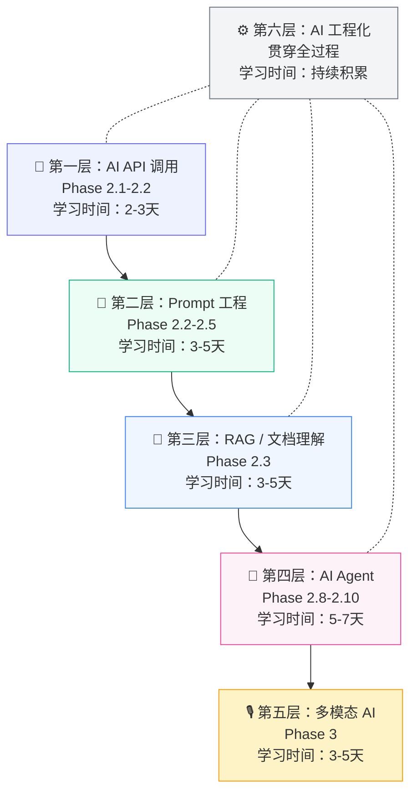
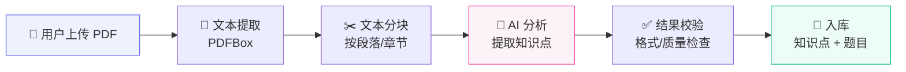
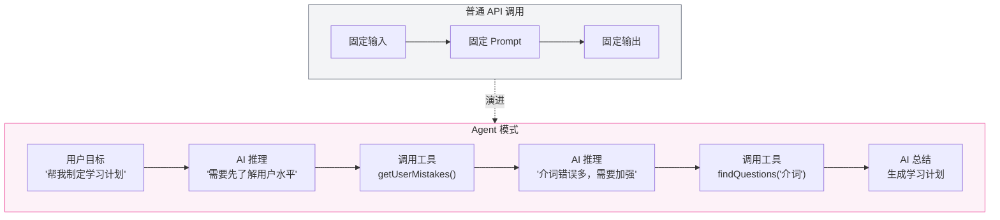
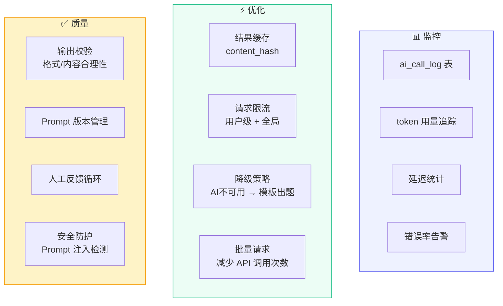

# AI 应用开发学习路线

> 从零到 Agent，以 LinguaLeap 项目为实践载体。

---

## 学习路径总览



---

## 第一层：AI API 调用

**对应 Phase**：2.1 - 2.2

**核心概念**：

| 概念 | 解释 | 项目实践 |
|------|------|---------|
| **Token** | LLM 处理的最小单位，大约 1 个中文字 = 1-2 token | GitHub Models 免费额度 100次/天, 40k tokens/min |
| **Temperature** | 控制输出的随机性，0=确定性，1=创意 | 出题用 0.3（稳定），对话用 0.7（自然） |
| **System Prompt** | 给 AI 设定的角色/规则 | "你是一位专业英语教师..." |
| **User Prompt** | 每次具体的请求 | "为单词 apple 出一道英译中选择题" |
| **Context Window** | 模型能处理的最大 token 数 | GPT-4o = 128K tokens |
| **Structured Output** | 要求 AI 按固定格式输出 | JSON mode 返回题目结构 |

**Spring AI 核心类**：

```java
// 1. ChatClient — 发送请求
@Autowired ChatClient chatClient;

var response = chatClient.prompt()
    .system("你是一位英语教师")
    .user("为单词 apple 出一道选择题，返回 JSON")
    .call()
    .content();  // 获取文本响应

// 2. Structured Output — 直接映射到 Java 对象
var question = chatClient.prompt()
    .user("出一道选择题")
    .call()
    .entity(QuestionDTO.class);  // 自动解析 JSON → Java
```

**项目中怎么用**：
- `service-ai` 封装 `AiChatService`
- 调用 GitHub Models GPT-4o 出题/分析/推荐
- 返回结构化 JSON，映射到 DTO

**复盘时要理解**：
- [ ] HTTP 请求怎么发到 GitHub Models 的
- [ ] token 是怎么计算的
- [ ] temperature 不同值的实际效果差异
- [ ] 出错了怎么重试/降级

---

## 第二层：Prompt 工程

**对应 Phase**：2.2 - 2.5

**核心技巧**：

| 技巧 | 说明 | 示例 |
|------|------|------|
| **角色设定** | 给 AI 一个专业身份 | "你是一位有20年经验的英语教师" |
| **任务明确** | 清晰描述要做什么 | "请为以下单词出一道英译中四选一题" |
| **格式约束** | 规定输出格式 | "请用 JSON 格式返回，包含 stem, options, answer 字段" |
| **Few-shot** | 给1-3个示例 | "示例输出：{stem: ..., options: [...]}" |
| **约束条件** | 限制 AI 不做什么 | "干扰项必须是同类词，不能出现明显荒谬选项" |
| **分步推理** | 让 AI 一步步思考 | "先分析这个单词的词性和常见搭配，然后出题" |

**Prompt 模板示例**：

```
[System]
你是一位专业英语教师，擅长为 {grade} 年级学生出题。
规则：
1. 难度适合 {grade} 年级
2. 干扰项必须合理，不能明显错误
3. 严格按 JSON 格式输出

[User]
请为以下单词出一道英译中四选一题：
单词：{word}
音标：{phonetic}
释义：{meaning}

输出格式：
{
  "stem": "题干文本",
  "options": ["A选项", "B选项", "C选项", "D选项"],
  "answer": "正确选项",
  "explanation": "解析"
}
```

**项目中怎么用**：
- 建立 Prompt 模板文件/类
- 变量替换（年级/单词/题型）
- AI 返回 JSON → 校验 → 入库

**复盘时要理解**：
- [ ] 好的 prompt 和差的 prompt 效果差多大
- [ ] Few-shot 给几个示例最合适
- [ ] 输出不符合格式时怎么处理
- [ ] 如何做 prompt 版本管理和 A/B 测试

---

## 第三层：RAG / 文档理解

**对应 Phase**：2.3

**核心流程**：



**关键问题与解决方案**：

| 问题 | 解决方案 |
|------|---------|
| PDF 太长，超出 context window | 文本分块，分批发给 AI |
| 提取的文本格式混乱 | 预处理：去多余空白、合并断行 |
| AI 提取的知识点不准确 | 校验规则 + 人工确认 |
| 图片/表格 PDF | 多模态 API 或预处理文本 |

**项目中怎么用**：
- Phase 1：PDFBox 纯文本提取（不涉及 AI）
- Phase 2：提取的文本 → 发给 GPT-4o → 返回结构化知识点
- 复杂 PDF → Gemini 多模态 API

**复盘时要理解**：
- [ ] 分块策略怎么选（固定长度 vs 语义分段）
- [ ] context window 不够时怎么处理长文档
- [ ] 多模态 API 和纯文本 API 的区别
- [ ] 缓存策略怎么设计（content_hash）

---

## 第四层：AI Agent

**对应 Phase**：2.8 - 2.10

**从 API 到 Agent 的演进**：



**Spring AI @Tool 示例**：

```java
// 定义工具 — Agent 可以自主决定是否调用
@Tool("查询用户的错题记录，分析薄弱环节")
public List<MistakeDTO> getUserMistakes(
    @Param("用户ID") Long userId,
    @Param("最近几天") int days
) {
    return mistakeService.getRecent(userId, days);
}

@Tool("从题库中查找指定主题的题目")
public List<QuestionDTO> findQuestions(
    @Param("主题关键词") String topic,
    @Param("难度1-5") int difficulty
) {
    return questionService.search(topic, difficulty);
}

// Agent 调用 — AI 自己决定用哪个工具
var plan = chatClient.prompt()
    .system("你是学习规划助手，可以查询用户数据来制定计划")
    .user("帮我制定本周英语学习计划")
    .tools(getUserMistakes, findQuestions)  // 注册工具
    .call()
    .content();
```

**ReAct 模式（推理 + 行动）**：
```
思考: 用户要学习计划，我需要了解他的薄弱点
行动: 调用 getUserMistakes(userId=1, days=7)
观察: 最近7天错了12道介词题，3道时态题
思考: 介词是主要薄弱点，我应该多安排介词练习
行动: 调用 findQuestions(topic="介词", difficulty=2)
观察: 找到38道介词题
输出: 本周计划：每天10道介词 + 5道时态，预计...
```

**复盘时要理解**：
- [ ] Agent 和普通 API 调用的本质区别
- [ ] @Tool 注解底层怎么工作的
- [ ] AI 怎么决定调用哪个工具
- [ ] 工具调用的安全性（防止 AI 做不该做的事）

---

## 第五层：多模态 AI

**对应 Phase**：3

**浏览器语音 API**：

| API | 能力 | 用途 |
|-----|------|------|
| `SpeechSynthesis` | 文字 → 语音 | 朗读单词/句子 |
| `SpeechRecognition` | 语音 → 文字 | 用户跟读识别 |

**项目中怎么用**：
- TTS：点击单词 → 浏览器朗读 → 学习发音
- STT：用户跟读 → 识别文字 → 和标准对比 → 评分
- AI 口语对话：STT 输入 → AI 回复 → TTS 输出

---

## 第六层：AI 工程化

**贯穿全过程**



---

## 你不需要学的

| 不需要学 | 原因 |
|---------|------|
| Python / PyTorch | 你不训练模型，只调 API |
| 线性代数 / 概率论 | 调 API 不需要懂数学 |
| Transformer 论文 | 会用就行，不需要造轮子 |
| GPU / CUDA | 模型跑在 Groq 云端 |
| 模型微调 / LoRA | 目前项目用不到 |

---

## 推荐学习资源

### Prompt Engineering
- OpenAI Prompt Engineering Guide（官方，最权威）
- Anthropic Prompt Library（实用示例集合）

### Spring AI
- Spring AI 官方文档（ChatClient + Tool Calling 章节）
- Spring AI GitHub 示例项目

### 通用 AI 概念
- 吴恩达 × DeepLearning.AI 的短课程系列（免费）
  - "ChatGPT Prompt Engineering for Developers"
  - "Building Systems with the ChatGPT API"
  - "LangChain for LLM Application Development"

> 以上资源在 Phase 2 开始前浏览即可，不需要提前啃完。
