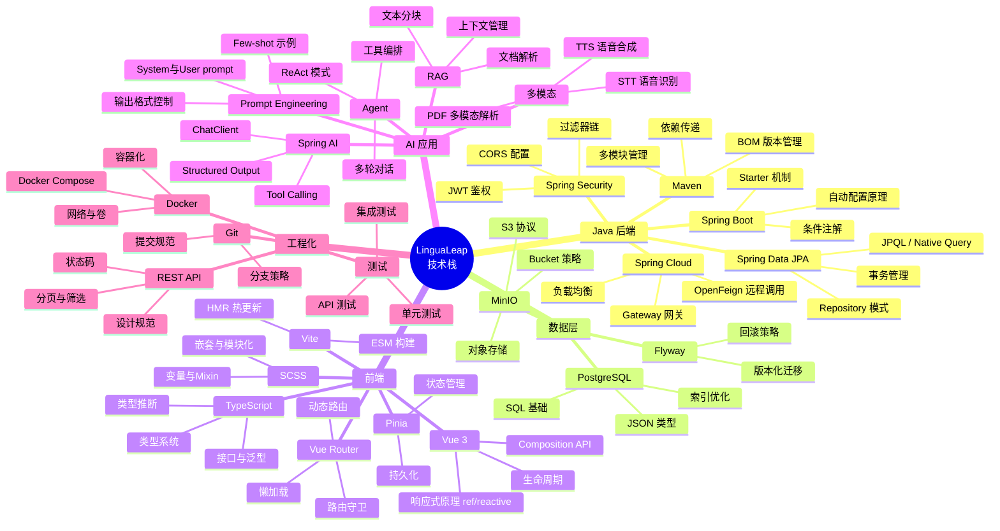
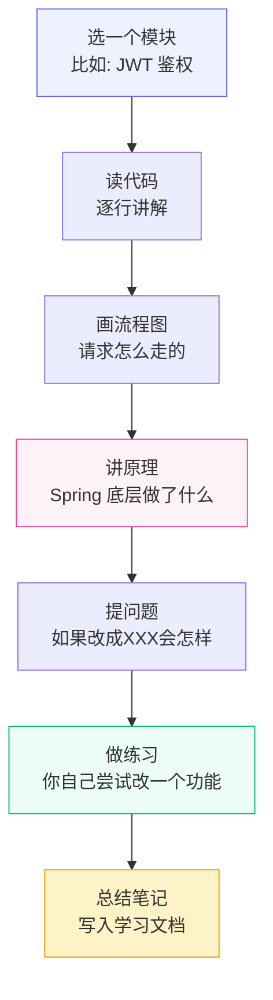

# LinguaLeap 技术学习路线

> 以项目实践为主线，做完再复盘，把用到的知识吃透。

---

## 学习理念

```
做项目（先跑通）→ 复盘代码（为什么这么写）→ 深入原理（底层怎么运作）→ 举一反三（还能怎么用）
```

---

## 知识全景图



---

## Phase × 知识点对照表

```mermaid
graph LR
    subgraph P0["Phase 0 ✅ 已完成"]
        P0A["Maven 多模块"]
        P0B["Spring Boot 启动"]
        P0C["Gateway + JWT"]
        P0D["JPA + Flyway"]
        P0E["Vue 3 + Router + Pinia"]
        P0F["Axios + 拦截器"]
        P0G["SCSS + 响应式布局"]
    end

    subgraph P1["Phase 1 ⬜ 题库+练习"]
        P1A["JPA 复杂查询<br/>分页/筛选"]
        P1B["REST API 设计<br/>CRUD 最佳实践"]
        P1C["业务逻辑设计<br/>出题引擎/SRS算法"]
        P1D["MinIO 文件存储"]
        P1E["PDFBox 文档解析"]
        P1F["Vue 组件化<br/>题型组件"]
        P1G["Chart.js 图表"]
        P1H["复杂状态管理<br/>练习流程"]
    end

    subgraph P2["Phase 2 ⬜ AI 智能"]
        P2A["Spring AI + Groq"]
        P2B["Prompt 模板系统"]
        P2C["PDF AI 分析<br/>RAG 模式"]
        P2D["AI 出题 + 质量校验"]
        P2E["缓存 + 限流"]
        P2F["Agent + Tool"]
        P2G["多轮对话"]
    end

    subgraph P3["Phase 3 ⬜ 语音"]
        P3A["Web Speech API"]
        P3B["TTS 朗读"]
        P3C["STT 识别"]
        P3D["AI 口语对话"]
    end

    P0 --> P1 --> P2 --> P3

    style P0 fill:#ECFDF5,stroke:#10B981
    style P1 fill:#EFF6FF,stroke:#3B82F6
    style P2 fill:#FDF2F8,stroke:#EC4899
    style P3 fill:#FEF3C7,stroke:#F59E0B
```



---

## 复盘计划

每个 Phase 完成后，按以下流程逐模块复盘：


